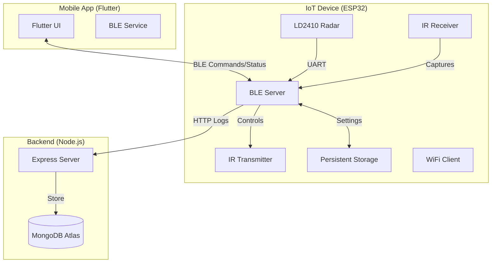

# AC Automation System (On/Off)

A smart, presence-aware AC control system that uses an ESP32, an LD2410 radar sensor, and an IR transmitter to automate air conditioning based on human presence.

## 🚀 Key Features

- **Presence-Based Automation**: Uses high-sensitivity 24GHz radar (LD2410) to detect human movement and static presence.
- **Intelligent Timings**: Configurable "On Time" (how long presence must be stable before turning ON) and "Off Time" (how long the room must be empty before turning OFF).
- **IR Learning & Replay**: Capture IR signals from any remote (Encoded or Raw) and store them in profiles.
- **BLE Management**: Fully controlled via a Flutter mobile application over Bluetooth Low Energy.
- **Cloud Integration**: Logs events (AC status change, presence) to a MongoDB backend (proxied through a Node.js server).
- **Offline Reliability**: All configurations, IR profiles, and Wi-Fi credentials survive power cuts via NVS (Non-Volatile Storage).

---

## 🏗️ System Architecture

---

## 🛠️ Components

### 1. ESP32 Firmware (`ac_ble.ino`)
The heart of the system. It manages sensor polling, IR signal processing, and BLE communication.
- **Pins**: IR TX (GPIO 15), IR RX (GPIO 13), Radar RX/TX (GPIO 16/17).
- **Logic**: Implements a state machine for presence. If presence is detected continuously for `presenceOnTime`, it triggers the `power_on` IR command.

### 2. Flutter App (`ac_automation`)
A modern mobile interface for managing the hardware.
- **Profile Management**: Create, edit, and delete AC brand profiles.
- **Real-time Monitoring**: View AC state and presence status via BLE notifications.
- **Remote Control**: Manually toggle the AC or send specific IR commands.
- **Settings**: Configure Wi-Fi and automation timings.

### 3. Backend Server (`ac_automation_server`)
A Node.js middleware that acts as a secure bridge.
- **Supabase Compatibility**: Intercepts legacy Supabase REST calls from the firmware.
- **Data Persistence**: Stores telemetry and sensor logs in MongoDB.

---

## 🔌 Hardware Setup

- **Controller**: ESP32 Dev Module.
- **Presence Sensor**: HLK-LD2410 (connected to UART2).
- **IR Transmitter**: IR LED with a transistor driver (GPIO 15).
- **IR Receiver**: TSOP1838 or similar (GPIO 13).

---

## 📡 BLE Communication Protocol

The system uses three main characteristics:
- **Command (Write)**: Send commands like `AC_ON`, `LEARN_START`, `SET_TIMING:60000:300000`.
- **Status (Notify)**: Receives status updates like `AC=ON|PRESENCE=STATIC|PROFILE=Daikin`.
- **IR Data (Notify)**: Used for streaming captured IR data or large JSON configs in chunks.

---

## ⚙️ Configuration

### Automation Timings
- **Presence ON Time**: Default 1 minute. The user must be in the room for this long before the AC turns on (prevents false triggers from people walking past).
- **Presence OFF Time**: Default 5 minutes. The room must be empty for this long before the AC turns off.

### Wi-Fi Setup
Sent via BLE command: `SET_WIFI:SSID:Password`. Once connected, the device logs telemetry to the backend.

---

## 📝 License
This project is for personal automation use.
